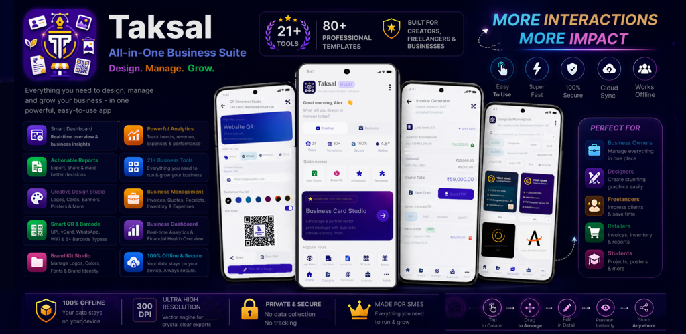

<div align="center">

  

  # Taksal Studio — Official Website & Legal Suite

  **World's #1 Free Creative Graphic Studio & SME Business Management Suite for Android**

  [](https://play.google.com/store/apps/details?id=com.card.mint.cardbuilder)
  [](https://pages.cloudflare.com/)
  [](https://developer.android.com/)
  [](app-ads.txt)
  [](TERMS_AND_CONDITIONS.md)

  <p align="center">
    <a href="#overview">Overview</a> •
    <a href="#pages--directory">Website Pages</a> •
    <a href="#app-adstxt-verification">app-ads.txt</a> •
    <a href="#key-app-features">App Features</a> •
    <a href="#deployment-to-cloudflare-pages">Cloudflare Deployment</a> •
    <a href="#legal--compliance">Legal & Privacy</a>
  </p>

  

</div>

---

## 🌟 Overview

This repository contains the official production website, search engine optimization (SEO) architecture, and legal compliance documentation for **Taksal Studio** (Android package: `com.card.mint.cardbuilder`).

Built with clean semantic HTML5, modern CSS3 custom properties (matching native Jetpack Compose design tokens), and pure vanilla JavaScript, this website requires **zero server-side runtime**, achieves near-instant TTFB (Time to First Byte), and deploys seamlessly on **Cloudflare Pages**, GitHub Pages, or Netlify.

### What is Taksal?
Derived from the Sanskrit/Hindi word *Taksal* (टकसाल — meaning "Mint", the sovereign place where valuable currency and stamps are crafted), Taksal Studio gives creators and small-to-medium enterprises (SMEs) their own sovereign pocket mint. It eliminates costly software subscription fees by combining:
1. **Canva-Grade Vector Graphic Design Studio** (300 DPI print-ready exports, multi-layer canvas, magnetic snapping, curved text).
2. **Complete SME Business Management Suite** (GST Invoicing, 58mm/80mm thermal POS slips, inventory stock tracking, and instant UPI payment QR codes).
3. **True Offline-First Data Sovereignty** (Local Room SQLite storage + Android KeyStore hardware-backed AES-256-GCM encryption).

---

## 📂 Pages & Directory Structure

```
.
├── index.html                   # Official Homepage (Hero, Bento features, 300 DPI showcase, FAQ, CTA)
├── features.html                # Deep dive into all 15+ built-in graphic & commerce tools
├── about.html                   # The Taksal story, offline-first manifesto, architecture & tech stack
├── support.html                 # Technical support: 300 DPI exports, thermal printer setup, trash vault
├── contact.html                 # Validated contact form & direct engineering support channels
├── faq.html                     # 4 categories of detailed FAQ with smooth accessible accordions
├── privacy.html                 # GDPR & CCPA/CPRA compliant Privacy Policy with sticky TOC
├── terms.html                   # Terms & Conditions: User IP retention & commercial tax disclaimers
├── app-ads.txt                  # Google AdMob Authorized Digital Sellers verification file
├── _headers                     # Cloudflare Pages custom response headers (MIME types, caching, CSP)
├── _redirects                   # Clean URL rewrites (/privacy, /terms, /features, /about, etc.)
├── sitemap.xml                  # Search Engine Optimization (SEO) XML sitemap
├── robots.txt                   # Crawler index directives
├── PRIVACY_POLICY.md            # Privacy Policy in GitHub-flavored Markdown
├── privacy-policy.txt           # Clean plain text Privacy Policy for Play Console submission
├── TERMS_AND_CONDITIONS.md      # Terms & Conditions in Markdown
├── HOSTING_AND_DEPLOYMENT_GUIDE.md # Complete hosting manual for Cloudflare, GitHub, & Netlify
└── assets/
    ├── css/
    │   ├── style.css            # Primary Material 3 / Compose design system stylesheet (27 KB)
    │   └── legal.css            # Legal documentation stylesheet (sticky TOC, callouts, print CSS)
    ├── js/
    │   └── main.js              # Theme switcher (dark/light), mobile drawer, tabs, screenshot lightbox
    └── images/
        ├── app-icon.png         # 512x512 official Google Play icon
        ├── feature-graphic.png  # 1024x500 Google Play feature banner
        ├── badges/              # Google Play SVG vector download badge
        └── screenshots/         # Web-optimized WebP & PNG screenshots from actual Android app
```

---

## 🛡️ `app-ads.txt` Verification

Google AdMob requires an `app-ads.txt` file placed at the root of the developer website listed on your Google Play Store listing to protect against unauthorized ad inventory spoofing.

The root file [`app-ads.txt`](app-ads.txt) contains:

```text
google.com, pub-7030166934019393, DIRECT, f08c47fec0942fa0
```

### Automatic Header Serving (`_headers`)
On Cloudflare Pages, the [`_headers`](_headers) file ensures this is served with the correct MIME type and caching headers:
```ini
/app-ads.txt
  Content-Type: text/plain; charset=utf-8
  Cache-Control: public, max-age=3600
  Access-Control-Allow-Origin: *
```

### Linking to Google Play Store
1. Open [Google Play Console](https://play.google.com/console) > Select **Taksal** (`com.card.mint.cardbuilder`).
2. Go to **Grow** > **Store presence** > **Store settings**.
3. Under **Store listing contact details**, set **Website** to your domain (e.g. `https://cardmint.app` or your Cloudflare Pages URL).
4. In [Google AdMob](https://admob.google.com/), open **Apps** > **app-ads.txt** > Click **Check for updates**. Status will update to **Authorized** (green checkmark).

---

## 🚀 Key App Features Highlighted on the Site

| Category | Major Capabilities |
| :--- | :--- |
| **Vector Graphic Studio** | Double-sided business cards, logos, posters, flyers, banners, social media posts. 300 DPI CMYK-ready print exports (PNG, JPG, PDF, SVG). |
| **Canva-Style Editor** | Drag-and-drop layer reordering, lock/hide layers, magnetic smart snapping, curved text, freehand brush, eyedropper, and Magic Layers (AI layer separation). |
| **GST Invoicing & Billing** | Compliant GST bills, automated tax rates (0%, 5%, 12%, 18%, 28%), client records, iText7 PDF generation, and instant WhatsApp sharing. |
| **Thermal POS Slips** | Standard 58mm and 80mm compact receipt slip generator for retail counters, printable via Bluetooth/USB ESC/POS printers. |
| **Inventory & Catalogs** | SKU tracking, quantities, unit prices, supplier contacts, low-stock alerts, and digital product lookbooks in PDF. |
| **Smart QR Hub & Barcodes** | Dynamic UPI Payment QR codes (PhonePe, GPay, Paytm, BHIM), WhatsApp chat links, Wi-Fi cards, vCards, and 1D/2D barcodes (Code 128, EAN-13, QR). |
| **Gemini 3.5 AI Studio** | Generative design briefs, logo concepts, and marketing copy with ephemeral in-memory sessions and encrypted API keys. |
| **Hardware KeyStore Vault** | 256-bit AES-GCM hardware-backed encryption protecting sensitive business data inside the Android Secure Enclave. |

---

## ⚡ Deployment to Cloudflare Pages (3 Steps)

### Step 1: Connect GitHub Repo
1. Log in to your [Cloudflare Dashboard](https://dash.cloudflare.com/).
2. Go to **Workers & Pages** > **Create application** > **Pages** > **Connect to Git**.
3. Select this repository: `codewithrahul444/taksal-web`.

### Step 2: Build Settings
* **Project name:** `taksal-web`
* **Production branch:** `main`
* **Framework preset:** `None`
* **Build command:** *(Leave empty)*
* **Build output directory:** `/` (or leave empty)

### Step 3: Click "Save and Deploy"
Cloudflare will build and publish your global edge deployment in ~15 seconds to `https://taksal-web.pages.dev`.

To attach a custom domain (e.g., `cardmint.app`), go to **Custom domains** in your Cloudflare Pages dashboard and follow the prompts.

---

## ⚖️ Legal & Privacy Compliance

* **Privacy Policy ([privacy.html](privacy.html) / [PRIVACY_POLICY.md](PRIVACY_POLICY.md)):** Accurately reflects that user data is stored 100% on-device in Room SQLite with zero proprietary cloud harvesting. Fully compliant with GDPR, UK DPA, CCPA/CPRA, and Google Play policies.
* **Terms & Conditions ([terms.html](terms.html) / [TERMS_AND_CONDITIONS.md](TERMS_AND_CONDITIONS.md)):** Grants users **100% commercial ownership and full copyright** over all designs, logos, cards, and invoices created with the software.
* **User Consent:** Integrated with Google User Messaging Platform (UMP) for GDPR/CCPA consent choices.

---

## 🛠️ Local Development & Preview

To preview the website locally on your computer:

```bash
# Clone the repository
git clone https://github.com/codewithrahul444/taksal-web.git
cd taksal-web

# Serve using Python's built-in HTTP server
python3 -m http.server 8000
```

Open your browser and navigate to `http://localhost:8000`.

---

## 📬 Contact & Support

* **Developer Entity:** Card Mint / Taksal Studio Engineering Team
* **Official Support Email:** [support@cardmint.app](mailto:support@cardmint.app)
* **Application Package:** `com.card.mint.cardbuilder`
* **Official Website:** [https://cardmint.app](https://cardmint.app)

---

<div align="center">
  <sub>© 2026 Taksal Studio. All rights reserved. Crafted with native Android precision.</sub>
</div>
